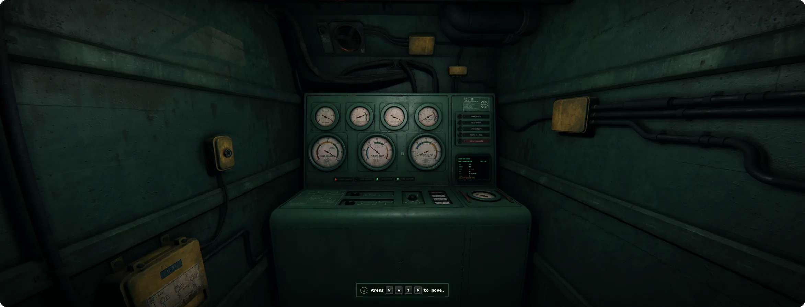
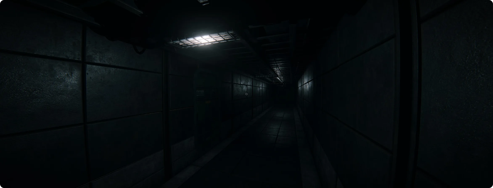
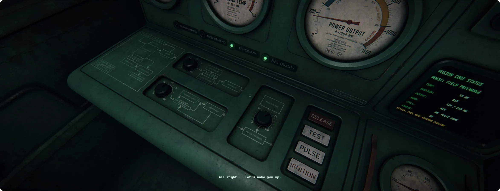

# OperatorGame

Browser-based first-person operator game about running an old industrial fusion-core installation from a physical control room.

The player is not a builder, factory manager, or omniscient engineer. They are a shift operator: reading analog gauges, warning lamps, screen fragments, sound, light, and room behavior while trying to keep the core inside a working range under rising grid demand.



## Design direction

Canonical game documents now live in [`docs/game/`](docs/game/README.md). This README is an onboarding and development overview; it is not a second design authority.

OperatorGame is about causal, physical-feeling control.

The main panel exposes a small set of powerful inputs:

- `Fuel Injection` raises heat and output, consumes fuel, and can hurt stability if the field is weak.
- `Magnetic Field` improves containment, but costs energy and can reduce useful output when overused.
- `Coolant Flow` removes heat, but too much cooling can quench the plasma and collapse output.
- `Emergency Vent / Purge` is a held emergency action. It can save the shift, but it interrupts production and carries a cost.

The player follows changing `Grid Demand` while watching `Plasma Temp`, `Containment / Stability`, `Power Output`, `Core Stress`, warning lamps, sound, flicker, blackout behavior, and post-processing feedback.

High temperature is not automatically failure. Late burn phases are meant to push the operator near the dangerous band. The interesting play is not “keep everything low”; it is deciding how much risk the machinery can survive.

## Current player flow

The current game begins with a first-run setup wizard for language, graphics, and gamma.

After setup, the player enters the main menu and opens the Assigned Shifts screen. The first available assignment is the First Operator Qualification Shift.

The playable route is:

```text
Setup Wizard -> Main Menu -> Assigned Shifts
-> Entrance Corridor -> Entrance Area -> Control Booth
-> Shift -> Return to Entrance -> Shift Report
```

The personnel elevator is implied during loading and is not a playable scene.

After successful qualification, Instrument Reliability Check and Cost of Running Trial become available.

Detailed progression and game rules live in [`docs/game/`](docs/game/README.md).





## Current architecture

Current code structure is tracked in [docs/project-structure.md](docs/project-structure.md). Older design documents are treated as direction notes, not as exact implementation architecture.

### Level lifecycle

Levels are loaded exclusively. The runtime must not load every registered level and hide inactive ones.

On a major route change, the current level owns and then disposes:

- scene objects;
- lights;
- interactions;
- collision;
- Rapier bodies;
- level-specific runtime state.

### Runtime ownership

- `PrefabRegistry` owns reusable defaults.
- Level configs own instance placement and per-instance tuning.
- Runtime systems own cloned objects, physics bodies, audio nodes, timers, and temporary state.
- Debug UI goes through `src/ui/debug/DebugHub.js`; new debug tools should not be bolted directly onto gameplay code.

Shared source GLBs and textures may remain cached through `AssetCache`, but cloned instances and physics state belong to the active level only.

Relevant modules:

- `src/levels/LevelRegistry.js` — level metadata and runtime environment registration.
- `src/runtime/LevelRuntimeManager.js` — atomic level transitions; latest request wins.
- `src/runtime/LevelRuntime.js` — idempotent disposal of level-owned resources.
- `src/runtime/AssetCache.js` — cached source assets and isolated cloned instances.
- `src/runtime/RuntimeSmoke.js` — automated lifecycle smoke test.
- `src/scene/LevelSceneBuilder.js` — architecture, collision, prefab markers, and prefab instances.

### Prefabs and marker placement

Reusable objects such as lamps, doors, panels, pumps, and control cabinets are prefabs. Shared behavior belongs in `src/prefabs/PrefabRegistry.js`, not in individual level configs.

A level may place a prefab manually in config:

```js
createPrefabInstance("fluorescentLamp", {
  name: "Lamp1_TutorialCabin",
  position: [3.6861, 1.49811, 2.39028],
});
```

Or with an Empty marker inside a Blender environment GLB:

```text
PF_fluorescentLamp_PowerHall1
PF_redBulkLamp_PowerHall1
PF_bulkheadDoor_C
```

Marker format:

```text
PF_<prefabType>_<instanceName>
```

Rules:

- `prefabType` must exist in `PrefabRegistry`.
- The marker must be an Empty object, not a render mesh.
- The runtime instance name becomes `<prefabType>_<instanceName>`.
- Manual prefabs with the same stable name override marker placement.
- Saved level overrides merge by stable prefab `name`.
- Registry-owned fields such as asset paths, material algorithms, physics algorithms, flicker behavior, and interaction logic must not be saved into level overrides.

### Level sessions

`src/levels/LevelSession.js` owns level objectives, bindings, events, and checkpoint data for the current shift.

Level-specific behavior should be expressed through session config and events where possible. For example:

- tutorial completion can require time survived plus opening a door;
- a room button can target a specific prefab lamp;
- future service-room tasks can listen for power, breaker, pump, or door events.

A level is allowed to have no `Panel1`; if no prefab with `behavior: "operatorPanel"` exists, the shared panel is hidden.

### UI and tutorial modules

- `src/app/AppShell.js` — high-level app shell: menu, settings, route transitions, briefings, pause, and progress.
- `src/app/BriefingUiConfig.js` — briefing zoom / inspect / vignette tuning.
- `src/app/SubtitleQueue.js` — operator thought subtitle queue.
- `src/app/TutorialHintQueue.js` — visual hint rendering with keycaps and mouse icons.
- `src/app/IntroTutorialFlow.js` — intro tutorial step machine and tutorial subtitle timing.
- `src/app/Localization.js` — English/Russian UI strings, control labels, subtitles, and hints.

Briefings are level-driven through `src/levels/LevelRegistry.js`. While a briefing is visible, gameplay input is locked. After the final sheet is dismissed, tutorial hints become non-blocking.

## Runtime modules

- `src/lighting/LightingRuntime.js` — level-owned ambient and point lights.
- `src/interactions/DoorInteractionSystem.js` — shared physical door interaction.
- `src/player/PlayerController.js` — movement, collision, step handling, jump, and debug collision display.
- `src/postprocessing/PostProcessingRuntime.js` — post-processing lifecycle.
- `src/panels/OperatorPanelRuntime.js` — operator panel lifecycle and visibility.
- `src/physics/PhysicsSystem.js` — Rapier physics, static collision, character controller, and physical doors.
- `src/scene/TextureStreaming.js` — staged texture loading to reduce first-load stalls.

## Development

Install dependencies:

```text
npm install
```

Run the local server:

```text
npm run dev
```

Open:

```text
http://localhost:5173/
```

If port `5173` is busy:

```powershell
$env:PORT=5174; npm run dev
```

Fast validation:

```text
npm run check
```

### Dev console commands

The app installs a small browser-console helper for route/progress testing:

```js
og("complete intro-shift")
og("complete unexpected-stuff")
og("complete fuel-problems")
og("goto intro-shift")
og("goto fuel-problems")
og("reset progress")
og("progress")
og("levels")
```

Equivalent method form:

```js
og.complete("intro-shift")
og.goto("unexpected-stuff")
og.resetProgress()
```

Direct aliases are also available:

```js
completeLevel("intro-shift")
attemptLevel("shift-coordination")
clearLevelProgress("fuel-problems")
gotoLevel("exploring-around")
resetProgress()
```

`goto` / `gotoLevel` bypass route unlocks, but still require the target level to be playable.

Runtime lifecycle smoke test:

```text
http://localhost:5173/?runtimeSmoke=1
```

Expected browser console result:

```text
[RuntimeSmoke] PASS
```

Manual playtesting is still needed for subjective behavior: door feel, lamp flicker, lighting mood, collision comfort, tutorial pacing, and presentation timing.

## Assets

- `assets/` contains runtime assets only: GLB, compressed textures, briefings, UI images, and lightweight README showcase WebP files.
- `source-assets/` contains source art, editable production files, and original heavy files. It is gitignored except for its README.
- `assets/repo/*.webp` are compressed showcase images for this README.
- Original showcase PNGs live in `source-assets/reference/showcase/`.

After changing runtime texture sources, run:

```text
generate-runtime-textures.bat
```

Generated preview and full KTX2 textures are written to:

```text
assets/runtime-textures/
```

## Deployment notes

This project is currently a static ES-module app. GitHub Pages can cache individual modules aggressively, so after JavaScript module changes run:

```text
npm run stamp-modules -- <revision>
```

Then run:

```text
npm run check
```

The stamp step updates relative module URLs such as `?v=<revision>` to avoid mixed old/new module graphs on Pages.

The Pages artifact should stay lean. Keep source PNGs, PSDs, recordings, screenshots, and deprecated content outside runtime `assets/` or under ignored source directories.

## Design document

See [`docs/game/README.md`](docs/game/README.md) for the current design index, canonical fusion-core rules, future-system integration audit, and the archived Unreal-oriented architecture draft.

The living Russian design document is [`docs/game/game-design-ru.md`](docs/game/game-design-ru.md).
