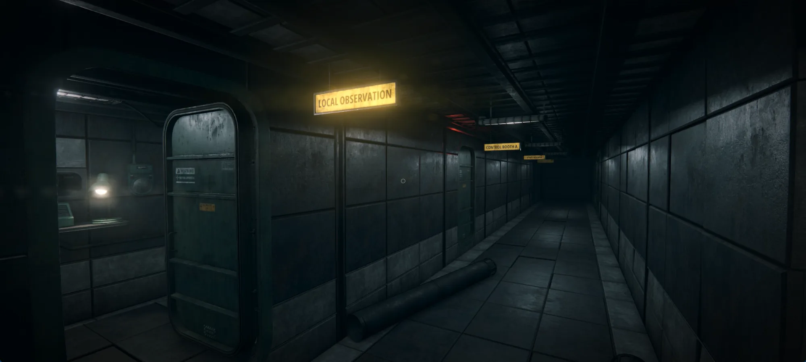
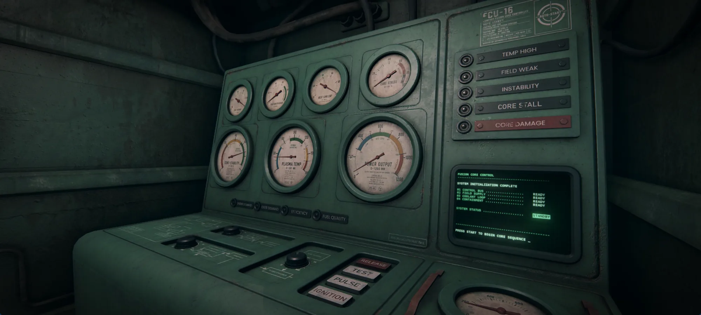
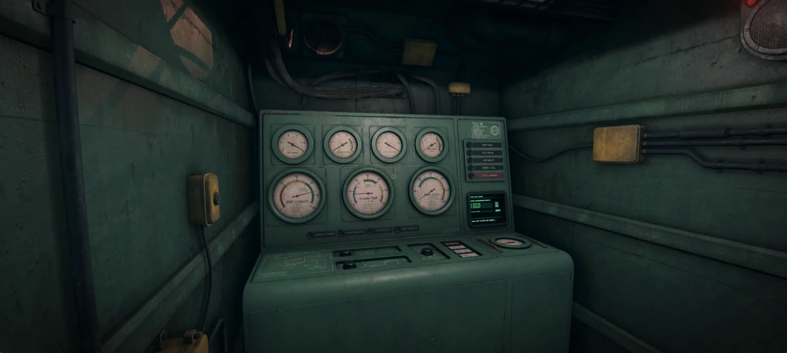
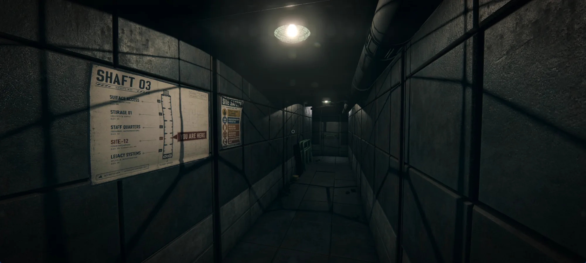

# SITE-12 / OperatorGame

> A first-person fusion-reactor operator game built for the browser.

[**Play the development build**](https://lutikri.github.io/web-3dGame1/) · [Game design](docs/game/README.md) · [Project structure](docs/project-structure.md)

> [!WARNING]
> **Active development build.** Content, balance, performance, saves, and presentation may change. The reactor will probably remain contained. Probably.



## About the game

You are a Terragen Systems shift operator assigned to Site-12, an aging underground fusion facility still expected to meet modern grid demand.

Read analog gauges, warning lamps, terminal reports, sound, light, and the behavior of the room itself. Balance fuel injection, magnetic containment, and coolant flow while demand rises and the machinery becomes less trustworthy. OperatorGame is about learning one physical control panel deeply—not building a factory from above.

## Current build

| System | Status |
| --- | --- |
| FCU-16 reactor simulation and physical control panel | Playable |
| Site-12 first-person exploration and interaction | Playable |
| Qualification Shift | Playable, balance pass in progress |
| Service terminal: brief, guide, reports, archive | Implemented |
| Main menu, assigned shifts, progression, and save data | Implemented |
| Real gameplay pause, preflight, and in-game settings | Implemented |
| English and Russian interface | Implemented, content pass ongoing |
| Instrument Reliability and Cost of Running trials | In development |

The current player route is:

```text
First launch -> Development notice -> Setup / Preflight -> Main Menu
-> Assigned Shift -> Entrance Corridor -> Service Terminal
-> Control Booth -> Reactor Shift -> Shift Report
```

After the Qualification Shift, **Instrument Reliability Check** and **Cost of Running Trial** become available. Both remain under active development.

## Inside Site-12

<table>
  <tr>
    <td width="50%">
      
      <br><sub>FCU-16 control booth</sub>
    </td>
    <td width="50%">
      
      <br><sub>Entrance corridor and shaft map</sub>
    </td>
  </tr>
  <tr>
    <td colspan="2">
      
      <br><sub>Local Observation wing</sub>
    </td>
  </tr>
</table>

## Reactor operation

The panel exposes a small set of controls with overlapping consequences:

- **Fuel Injection** raises heat and output, consumes fuel, and can damage stability when containment is weak.
- **Magnetic Field** improves containment but consumes energy and can reduce useful output when overused.
- **Coolant Flow** removes heat, while excessive cooling can quench the plasma and collapse output.
- **Emergency Vent / Purge** can rescue a failing run, but interrupts production and carries a cost.

The goal is not to keep every gauge low. Late phases deliberately push the reactor toward its dangerous band; the player must match **Grid Demand** without allowing warnings, instability, or core stress to become critical.

## Roadmap

### Completed foundations

- [x] Physical FCU-16 reactor loop, gauges, controls, warnings, and failures
- [x] First-person Site-12 spaces, interaction, collision, lighting, and audio
- [x] Paper brief replacement: interactive in-world service terminal
- [x] Real pause with frozen simulation and in-game settings
- [x] Preflight quality profiles and one-time development-build notice

### Now — qualification and onboarding

- [ ] Rebalance Qualification so success requires real demand compliance and stable operation
- [ ] Add a meaningful Shift Report: compliance, stability, and critical-event results
- [ ] Make the tutorial event-driven, with fast restart and no repeated mandatory narration
- [ ] Finalize tutorial retry and post-qualification **Skip Training** behavior
- [ ] Separate the one-time lore intro from short repeatable shift loading sequences

### Next — complete the three-shift vertical slice

- [ ] Finish **Instrument Reliability Check**, including flashlight-driven redundant-instrument reading
- [ ] Finish **Cost of Running Trial** for players who understand the reactor loop
- [ ] Test all three shifts end-to-end: briefing, gameplay, fail/win, report, unlocks, save, and EN/RU

### Later — world presentation and polish

- [ ] Complete the Observation Port: viewport shutter and alarm-silence controls
- [ ] Build the personnel-accommodation scene used behind the main menu
- [ ] Final presentation, accessibility, performance, and compatibility pass

The detailed release scope and canonical gameplay rules live in [`docs/game/`](docs/game/README.md). Ideas outside the three-shift package are tracked separately and do not block the vertical slice.

## Technology

`Three.js` · `Rapier 3D` · `Web Audio` · `postprocessing` · `Vite` · static ES modules

The game uses exclusive level loading, reusable prefab behaviors, level-owned runtime state, compressed texture streaming, configurable graphics profiles, and an automated lifecycle smoke test. A concise ownership map is maintained in [`docs/project-structure.md`](docs/project-structure.md).

## Run locally

```bash
npm install
npm run dev
```

Open `http://localhost:5173/`.

Useful commands:

```bash
npm run check
npm run build
```

Runtime lifecycle smoke test:

```text
http://localhost:5173/?runtimeSmoke=1
```

Expected browser-console result: `[RuntimeSmoke] PASS`.

## Repository guide

| Path | Purpose |
| --- | --- |
| `src/app/` | Menus, routing, localization, preflight, pause, and progression UI |
| `src/levels/` | Level definitions, objectives, events, and stable placement data |
| `src/prefabs/` | Reusable world objects and their runtime behaviors |
| `src/player/`, `src/physics/`, `src/runtime/` | First-person movement, collision, loading, and lifecycle ownership |
| `assets/` | Runtime-ready models, textures, audio, UI, and README images |
| `source-assets/` | Editable and heavyweight source art; excluded from deployment |
| `docs/` | Architecture and canonical game-design documentation |

After JavaScript module changes, stamp import URLs before deployment so GitHub Pages does not mix cached module revisions:

```bash
npm run stamp-modules -- <short-revision-name>
npm run check
```

Heavy source images, recordings, and deprecated assets must stay outside `assets/` to keep the Pages artifact lean.

## Documentation

- [Game design index](docs/game/README.md)
- [Living Russian design document](docs/game/game-design-ru.md)
- [FCU-16 reactor rules](docs/game/fusion-core.md)
- [Project structure and ownership](docs/project-structure.md)
